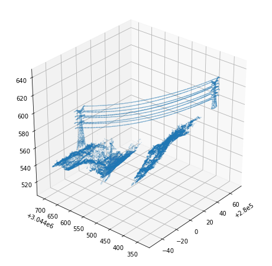

# Powerline Detection From LiDAR Data
> Summary description here.


```python
%load_ext autoreload
%autoreload 2
```

This file will become your README and also the index of your documentation.

## Install

`pip install lyutool`

## How to use

Fill me in please! Don't forget code examples:

```python
las_fp = pathlib.Path('/home/hxl170008/data/t_remain.las')
point_cloud = lp.file.File(las_fp, mode='r')
points = np.vstack((point_cloud.x, point_cloud.y, point_cloud.z)).transpose()
dc = grid_subsampling(points, 1/2)
grid_barycenter = dc['barycenter']
grid_candidate = dc['candidate']
```

    (3,)


    100%|██████████| 71054/71054 [00:03<00:00, 20889.96it/s]


```python
%matplotlib inline
decimated_points = np.array(grid_candidate)
plt.figure(figsize=[8,8])
ax = plt.axes(projection='3d')
ax.scatter(decimated_points[:,0], decimated_points[:,1], decimated_points[:,2], s=0.01)
ax.view_init(azim = 180+40,elev = 30)
plt.show()
```




