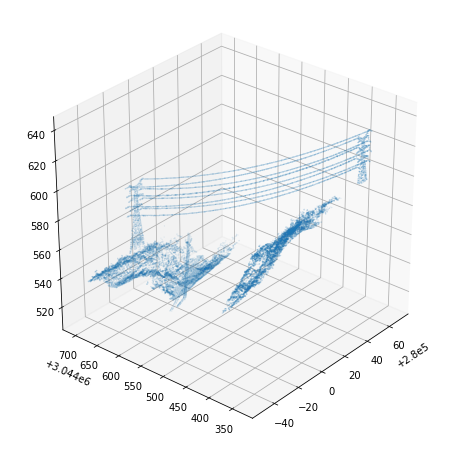

# Powerline Detection From LiDAR Data
> Summary description here.


```python
%load_ext autoreload
%autoreload 2
```

This file will become your README and also the index of your documentation.

## Install

`pip install lyutool`

## How to use

Read LiDAR data with the extension of .las, which is stored in the folder of 'testdata'. 

```python
las_fp = pathlib.Path('testdata/t_remain.las')
inFile = lp.file.File(las_fp, mode='r')
classification = inFile.classification
xyz = np.vstack([inFile.x, inFile.y, inFile.z]).transpose()
xyz_min = np.min(xyz, axis=0)
xyz_max = np.max(xyz, axis=0)
# Record the index information of each category
idx = classification == 1
lp_1 = generateLPByIDS(idx)
idx = classification == 10
lp_10 = generateLPByIDS(idx)
idx = classification == 11
lp_11 = generateLPByIDS(idx)
idx = classification == 19
lp_19 = generateLPByIDS(idx)
#
tree = KDTree(xyz)
```


    ---------------------------------------------------------------------------

    NameError                                 Traceback (most recent call last)

    <ipython-input-58-7059e4d0714a> in <module>
          7 # Record the index information of each category
          8 idx = classification == 1
    ----> 9 lp_1 = generateLPByIDS(idx)
         10 idx = classification == 10
         11 lp_10 = generateLPByIDS(idx)


    NameError: name 'generateLPByIDS' is not defined


```python
las_fp = pathlib.Path('testdata/t_remain.las')
point_cloud = lp.file.File(las_fp, mode='r')
points = np.vstack((point_cloud.x, point_cloud.y, point_cloud.z)).transpose()
dc = grid_subsampling(points, 1)
grid_barycenter = dc['barycenter']
grid_candidate = dc['candidate']
```

    (3,)


    100%|██████████| 26523/26523 [00:01<00:00, 20719.37it/s]


```python
%matplotlib inline
decimated_points = np.array(grid_candidate)
plt.figure(figsize=[8,8])
ax = plt.axes(projection='3d')
ax.scatter(decimated_points[:,0], decimated_points[:,1], decimated_points[:,2], s=0.01)
ax.view_init(azim = 180+40,elev = 30)
plt.show()
```




